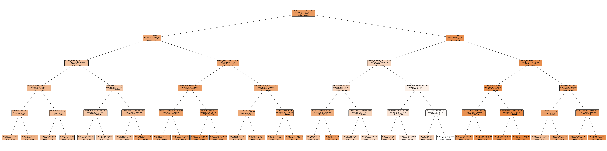
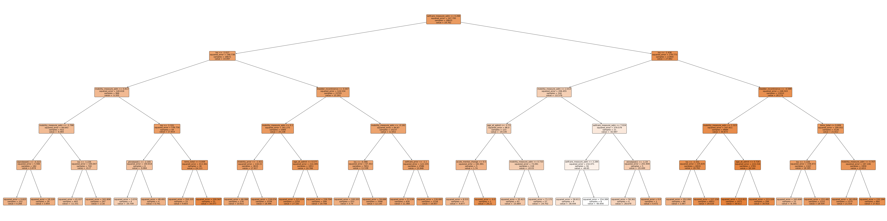
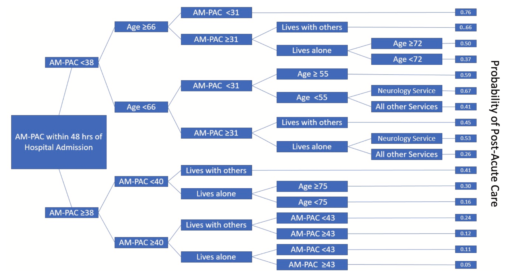
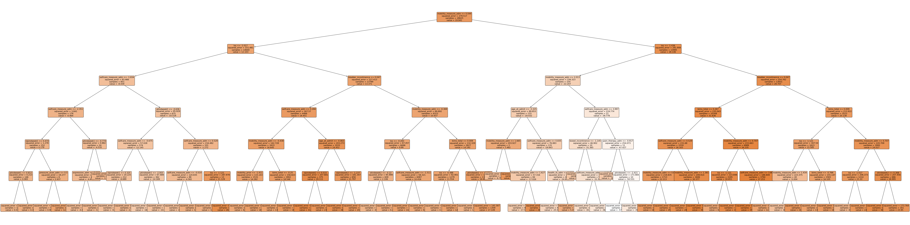

# QA & Updates 2024/12/16

Dingyi Nie

## 1 Questions about data & preprocessing

- **Are we using MICE?**

  Yes. We switched from traditional mean imputation to MICE weeks ago. All the later results are based on MICE imputed data.

  To be specific, the implementation used is from [scikit-learn's iterative imputer](https://scikit-learn.org/1.5/modules/generated/sklearn.impute.IterativeImputer.html) (`sklearn.impute.IterativeImputer`), which is a highly adjustable implementation of the original [MICE](https://www.jstatsoft.org/article/view/v045i03). Iterative imputers were initialized with an initial strategy of `mean`, and max number of regression iterations is set to 50. Imputers were trained on training split of the data (with the outcome columns removed). After around 4 iterations of regression, the average change in imputed values reaches below the scaled tolerance and optimization is stopped.

- **Do we have variable statistics report?**

  Yes. We have one for continuous variables and last week I made a summary for categorical features as well.

  For the continous variables, most of them are not perfectly normal (given the large amount of data samples in the dataset, normality p-values tend to be close to 0 for all), so `mean`, `std`, and `0%`/`25%`/`50% (median)`/`75%`/`100%` intervals are reported.

  For publication purpose, these tables can be easily exported directly from Python scripts as LaTeX or stylized HTML to be rendered in publication quality. Here I convert it to markdown for better display quality:

  | Variable Name          | Count |   Mean |    Std |    Min |    25% |    50% |    75% |    Max | N/A Ratio |
  | :--------------------- | ----: | -----: | -----: | -----: | -----: | -----: | -----: | -----: | --------: |
  | selfcare_measure_delta | 42938 |  19.84 |  21.31 | -80.99 |   5.60 |  12.63 |  38.93 |  80.99 |      0.00 |
  | mobility_measure_delta | 42938 |  19.57 |  20.53 | -93.52 |   7.71 |  14.65 |  27.95 |  93.52 |      0.00 |
  | ptindweek1             | 42938 | 334.86 |  98.03 |   0.00 | 275.00 | 330.00 | 405.00 | 600.00 |      0.00 |
  | otindweek1             | 42938 | 343.73 |  93.49 |   0.00 | 300.00 | 345.00 | 407.00 | 600.00 |      0.00 |
  | slpindweek1            | 42938 | 206.41 |  97.23 |   0.00 | 143.00 | 225.00 | 283.00 | 590.00 |      0.00 |
  | ptindweek2             | 42938 | 267.26 | 153.44 |   0.00 | 165.00 | 300.00 | 379.00 | 600.00 |      0.00 |
  | otindweek2             | 42938 | 267.13 | 150.43 |   0.00 | 180.00 | 300.00 | 370.00 | 600.00 |      0.00 |
  | slpindweek2            | 42938 | 161.12 | 125.04 |   0.00 |  30.00 | 163.00 | 270.00 | 600.00 |      0.00 |
  | hearing_adm            | 42938 |   0.30 |   0.63 |   0.00 |   0.00 |   0.00 |   0.00 |   3.00 |      0.00 |
  | vision_adm             | 42938 |   0.45 |   0.76 |   0.00 |   0.00 |   0.00 |   1.00 |   4.00 |      0.00 |
  | health_lit_adm         | 39485 |   1.10 |   1.29 |   0.00 |   0.00 |   1.00 |   2.00 |   4.00 |      0.08 |
  | expression_adm         | 42938 |   3.20 |   0.91 |   1.00 |   3.00 |   3.00 |   4.00 |   4.00 |      0.00 |
  | understand_verbal_adm  | 42938 |   3.36 |   0.80 |   1.00 |   3.00 |   4.00 |   4.00 |   4.00 |      0.00 |
  | bims_total             | 38280 |  12.02 |   3.61 |   0.00 |  10.00 |  13.00 |  15.00 |  15.00 |      0.11 |
  | acute_mental_change    | 42938 |   0.27 |   0.45 |   0.00 |   0.00 |   0.00 |   1.00 |   1.00 |      0.00 |
  | socisolation_adm       | 38800 |   0.44 |   0.77 |   0.00 |   0.00 |   0.00 |   1.00 |   4.00 |      0.10 |
  | selfcare_prior         | 42663 |   2.88 |   0.34 |   1.00 |   3.00 |   3.00 |   3.00 |   3.00 |      0.01 |
  | mobility_prior         | 42316 |   2.92 |   0.29 |   1.00 |   3.00 |   3.00 |   3.00 |   3.00 |      0.01 |
  | selfcare_measure_adm   | 42938 |  40.34 |   7.73 |  19.65 |  36.97 |  41.35 |  44.77 | 100.64 |      0.00 |
  | mobility_measure_adm   | 42938 |  24.16 |   9.01 |   4.86 |  19.16 |  24.31 |  30.29 |  98.38 |      0.00 |
  | bladder_incontinence   | 40423 |   1.38 |   1.55 |   0.00 |   0.00 |   0.00 |   3.00 |   5.00 |      0.06 |
  | bowel_incontinence     | 37086 |   0.80 |   1.17 |   0.00 |   0.00 |   0.00 |   2.00 |   3.00 |      0.14 |
  | pvd_comorbid           | 42938 |   0.06 |   0.24 |   0.00 |   0.00 |   0.00 |   0.00 |   1.00 |      0.00 |
  | pain_sleep_adm         | 42938 |   1.50 |   1.93 |   0.00 |   0.00 |   1.00 |   2.00 |   8.00 |      0.00 |
  | pain_therapy_adm       | 30695 |   1.85 |   2.19 |   0.00 |   1.00 |   1.00 |   2.00 |   8.00 |      0.29 |
  | pain_activities_adm    | 30695 |   2.16 |   2.09 |   1.00 |   1.00 |   1.00 |   2.00 |   8.00 |      0.29 |
  | pressure_ulcer_adm     | 42938 |   0.11 |   0.31 |   0.00 |   0.00 |   0.00 |   0.00 |   1.00 |      0.00 |
  | age_at_admit           | 42938 |  68.73 |  13.45 |   1.00 |  61.00 |  70.00 |  79.00 |  90.00 |      0.00 |
  | los                    | 42938 |  16.20 |   9.54 |   1.00 |  10.00 |  14.00 |  21.00 | 337.00 |      0.00 |

  Categorical variables:

  | Variable Name    | # Unique Values |         Mode | Mode Ratio | Unknown Ratio |
  | ---------------- | --------------: | -----------: | ---------: | ------------: |
  | falls_hx         |               3 |           No |       0.62 |          0.06 |
  | marital_status   |               3 |    Unmarried |       0.48 |          0.06 |
  | depressed_adm    |               3 |            0 |       0.74 |          0.11 |
  | payor_primary    |               3 | Medicare_FFS |       0.37 |          0.00 |
  | hispanic         |               2 |           No |       0.93 |          0.00 |
  | sex              |               2 |         male |       0.53 |          0.00 |
  | stroke_type      |               3 |     Ischemic |       0.83 |          0.00 |
  | low_interest_adm |               3 |            0 |       0.78 |          0.11 |
  | race             |               7 |        White |       0.68 |          0.06 |

- **Ordinal variables: how are they approached?**

  Ordinal variables, such as BIMS score, will go through all the preprocessing stages (getting rid of outliers, imputation, standardization) and once they are all done, the model will treat them as continous variables.

## 2 Questions about global summary decision trees

- **These trees are ugly!**

  For easy re-runability in Python environment, the current two visualizations,

  Selfcare:

  

  and Mobility:

  

  are done by following these steps:

  1. Fit a random forest model to the training split of data $(X, y_\text{true})$
  2. Get the output of the random forest model, forming pairs $(X, y_\text{predict})$
  3. Regress a single decision tree on $(X, y_\text{predict})$ using `sklearn.tree.DecisionTreeRegressor`
  4. Visualize the tree using `sklearn.tree.plot_tree`

  The authors of [this paper](https://www.sciencedirect.com/science/article/pii/S2211883723000308), which has this beutiful summary tree for our reference

  

  didn't provide code of how they exactly made it, so this is my own implementation based on their text descriptions. I suspect they made the graph manually in design softwares such as Powerpoint.

  On our side, because each time we make adjustment to the data (variable selection, imputation strategy, data splits, standardization... etc), this tree can change (it is nondeterministic after all). I use `sklearn.tree.plot_tree`, which limits to a vertical view, for quick demonstration only. Once everything is finalized, we can make one in Powerpoint as well.

- **Where are the prediction results shown on the current tree graphs?**

  Each node has 4 lines in it:

  1. **Splitting criteria**: samples that satisfy the criteria go to the left child, others go right. Please note that almost all decision tree implementations use binary splits for efficiency and scalability, and the criteria's comparison direction is consistently "`some_variable <= some_value`", instead of "`>=`". This is why if you look at the leaf nodes only, they are not sorted from left to right in increasing order of predicted values. We have to manually re-arrage the nodes to make it look like our reference summary tree (please also note that in the reference summary tree the leaves are also not sorted, as we can see it jumps from 0.41 back to 0.26 in the middle)
  2. **Squared error**: the average predictive error of all data samples that fall under the subtree whose root is the current node
  3. **Number of samples**: in the subtree
  4. **Value**: this is the average predicted value (i.e. selfcare or mobility score difference as `discharge - admission`)

  Also please note that for some reason, in the reference summary tree some nodes are not binary and have only one child. I suspect they manually got rid of one of the two children because its proportion is too small.

- **How can we adjust the tree?**

  As mentioned earlier, these trees are the honest visualization of a single binary decision tree. So by adjusting parameters of the decision tree, we can control the depth of it. But to do so may change how well the single binary decision tree can represent the whole random forest (i.e. the R square may change).

  For example, this is how the selfcare tree looks like if we go one layer deeper:

  

## 3 Questions about Lasso regression

- **Are the predictors standardized?**

  Yes, all predictors are standardized. The outcomes (regression targets) are the only thing that's not standardized.

  Standardization is done after MICE imputation. Are predictors are standardized to have mean of 0 and std of 1.

- **Performance is not ideal!**

  Indeed, RF performs way better than lasso regression, especially on training set (e.g. for selfcare, RF has R square of 90.87% on training set and 34.22% on testing set, while lasso without interactions only has 24.03% and 24.17% respectively).

  I suspect the main reason for this is still the non-linearity in data. After interactions are introduces, R squares of lasso are improved by >4%.

  With ridge regression (no interactions), R squares are similarly at 24.28% and 24.25% respectively.

  From my personal experiences, I think the results look normal and the patterns seem very common especially in biomedical fields. Linear regression provides insights of correlations and contributions of individual predictors treated as independent variables, while usually non-linear models like RF or XGBoost or even neural networks capture complicated non-linear patterns, improve performance, but sacrifice interpretability. There is a typical trade-off between predictive power and complexity.

  

  