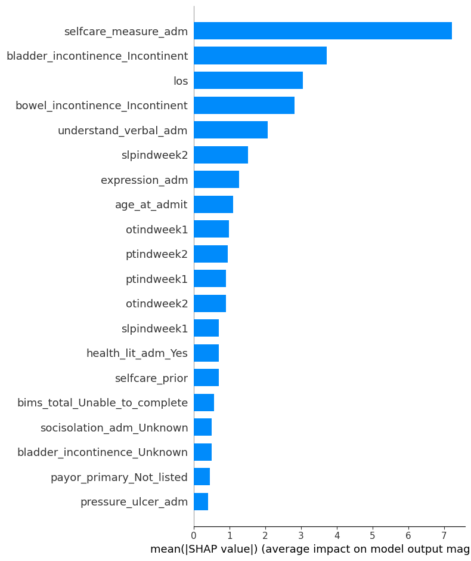
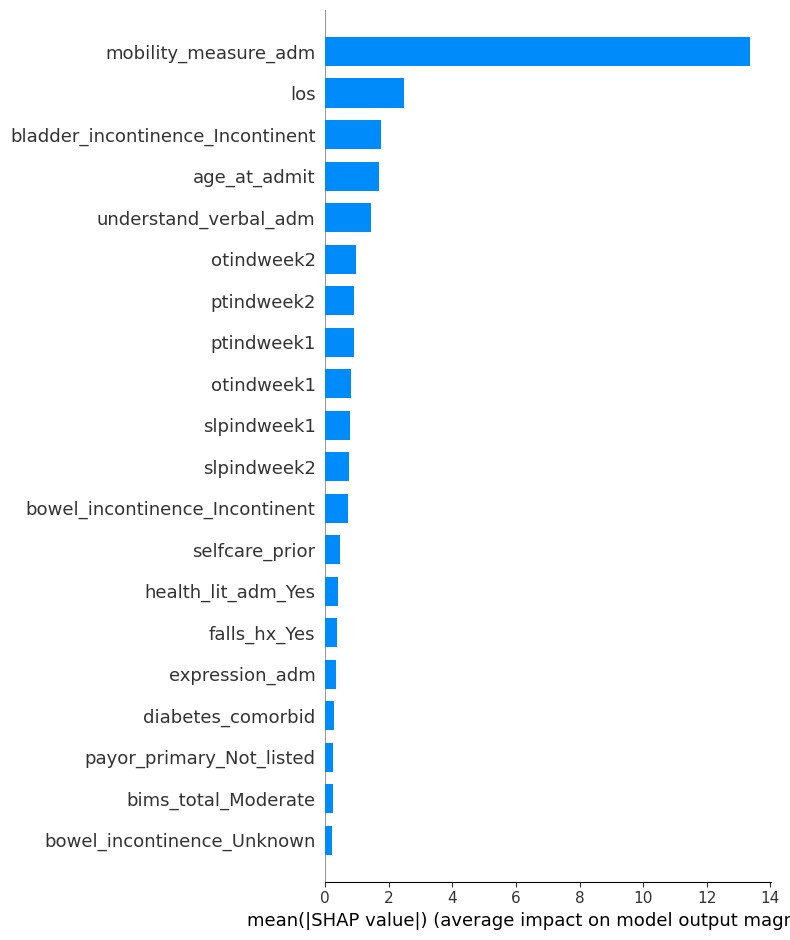
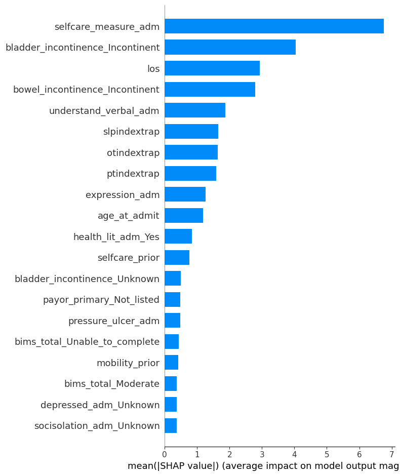
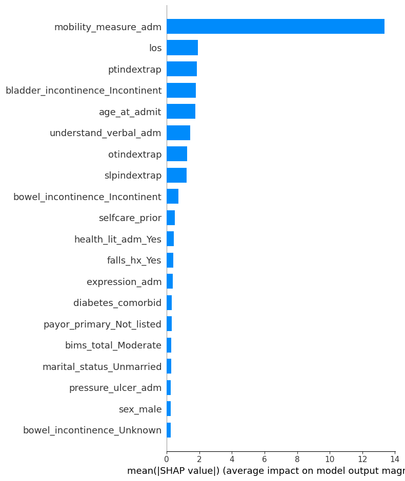
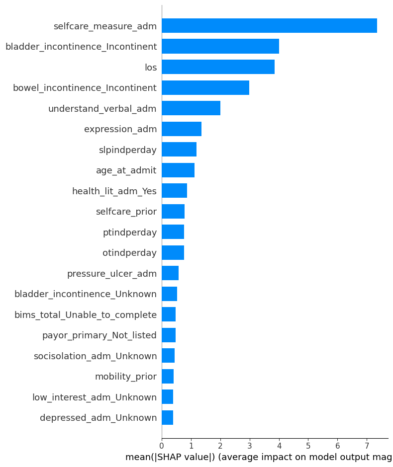
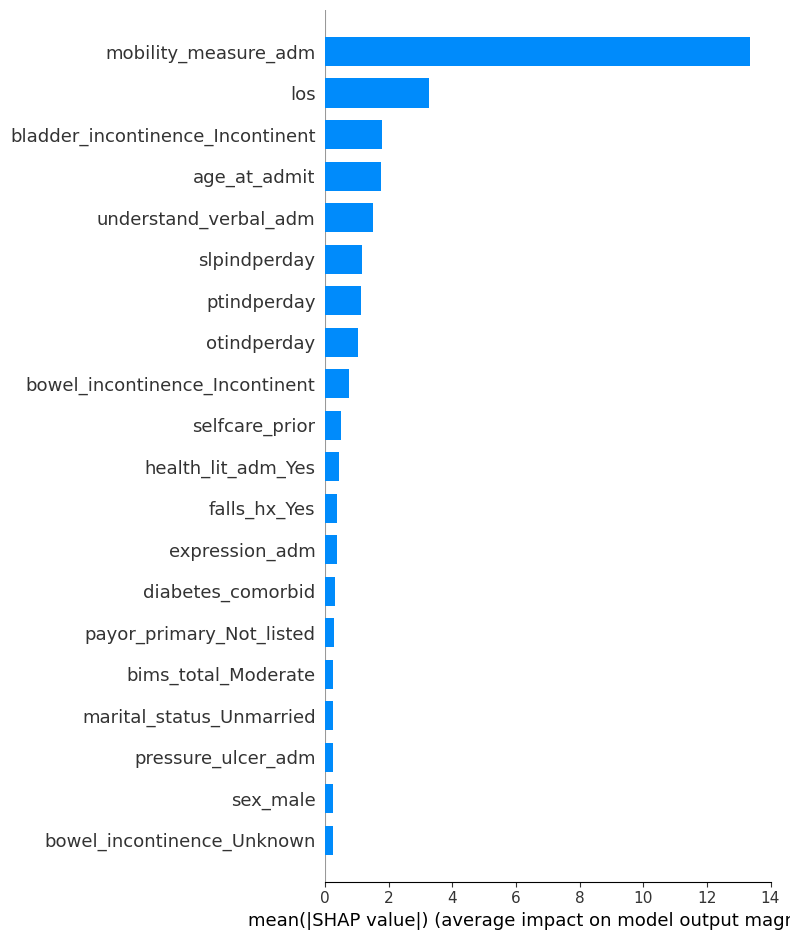
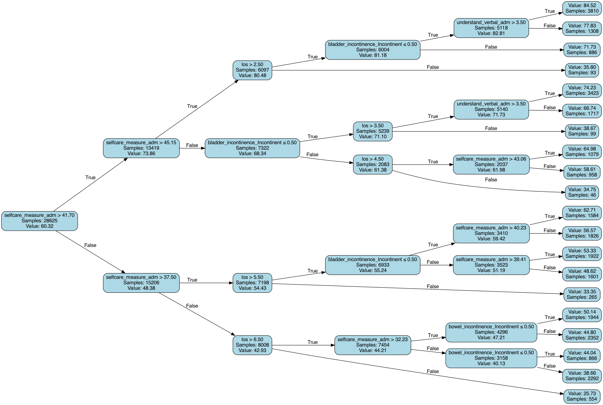
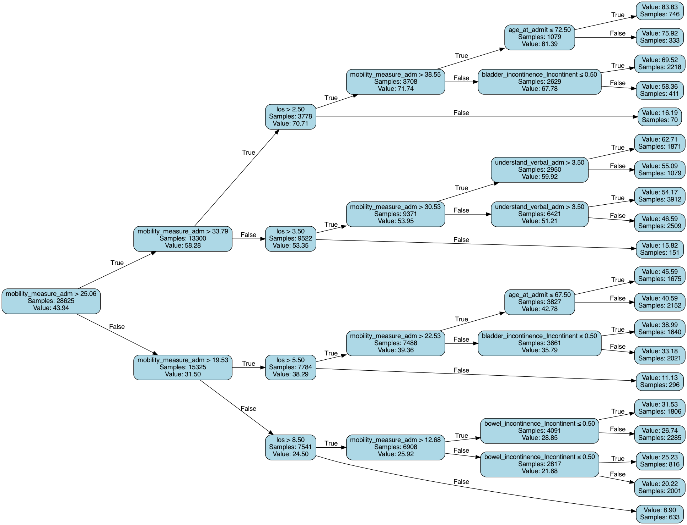

# Follow-ups on Therapy Predictors Processing

Dingyi Nie

## 1. Updated histograms

Added new variables:

- `pt/ot/slpindweek1+2`: basically adding week1 + week2 doses.
- `pt/ot/slpindperday`: (week1 + week2)/los. If los > 14, it's clipped to 14 when calculating.
- `pt/ot/slpindextrap`: extrapolated total doses, i.e. perday * los.


## 1. Baseline

Same as discussed before, using pt/ot/slp ind week1 & week2 doses as therapy predictors.

This serves as a comparison baseline.

All used predictors:

```
+---------+------------------------------------------------+---------+-------------+
|   Index | Name                                           | Dtype   |   # of NaNs |
+=========+================================================+=========+=============+
|       0 | ptindweek1+2                                   | float64 |           0 |
+---------+------------------------------------------------+---------+-------------+
|       1 | otindweek1+2                                   | float64 |           0 |
+---------+------------------------------------------------+---------+-------------+
|       2 | slpindweek1+2                                  | float64 |           0 |
+---------+------------------------------------------------+---------+-------------+
|       3 | expression_adm                                 | float64 |           0 |
+---------+------------------------------------------------+---------+-------------+
|       4 | understand_verbal_adm                          | float64 |           0 |
+---------+------------------------------------------------+---------+-------------+
|       5 | acute_mental_change                            | float64 |           0 |
+---------+------------------------------------------------+---------+-------------+
|       6 | selfcare_prior                                 | float64 |           0 |
+---------+------------------------------------------------+---------+-------------+
|       7 | mobility_prior                                 | float64 |           0 |
+---------+------------------------------------------------+---------+-------------+
|       8 | selfcare_measure_adm                           | float64 |           0 |
+---------+------------------------------------------------+---------+-------------+
|       9 | mobility_measure_adm                           | float64 |           0 |
+---------+------------------------------------------------+---------+-------------+
|      10 | pvd_comorbid                                   | float64 |           0 |
+---------+------------------------------------------------+---------+-------------+
|      11 | diabetes_comorbid                              | float64 |           0 |
+---------+------------------------------------------------+---------+-------------+
|      12 | pressure_ulcer_adm                             | float64 |           0 |
+---------+------------------------------------------------+---------+-------------+
|      13 | age_at_admit                                   | float64 |           0 |
+---------+------------------------------------------------+---------+-------------+
|      14 | los                                            | float64 |           0 |
+---------+------------------------------------------------+---------+-------------+
|      15 | sex_male                                       | float64 |           0 |
+---------+------------------------------------------------+---------+-------------+
|      16 | marital_status_Unknown                         | float64 |           0 |
+---------+------------------------------------------------+---------+-------------+
|      17 | marital_status_Unmarried                       | float64 |           0 |
+---------+------------------------------------------------+---------+-------------+
|      18 | payor_primary_Medicare_FFS                     | float64 |           0 |
+---------+------------------------------------------------+---------+-------------+
|      19 | payor_primary_Not_listed                       | float64 |           0 |
+---------+------------------------------------------------+---------+-------------+
|      20 | stroke_type_Ischemic                           | float64 |           0 |
+---------+------------------------------------------------+---------+-------------+
|      21 | stroke_type_Other                              | float64 |           0 |
+---------+------------------------------------------------+---------+-------------+
|      22 | hispanic_Yes                                   | float64 |           0 |
+---------+------------------------------------------------+---------+-------------+
|      23 | race_Asian                                     | float64 |           0 |
+---------+------------------------------------------------+---------+-------------+
|      24 | race_Black_or_African_American                 | float64 |           0 |
+---------+------------------------------------------------+---------+-------------+
|      25 | race_Multiracial                               | float64 |           0 |
+---------+------------------------------------------------+---------+-------------+
|      26 | race_Native_Hawaiian_or_Other_Pacific_Islander | float64 |           0 |
+---------+------------------------------------------------+---------+-------------+
|      27 | race_Unknown                                   | float64 |           0 |
+---------+------------------------------------------------+---------+-------------+
|      28 | race_White                                     | float64 |           0 |
+---------+------------------------------------------------+---------+-------------+
|      29 | hearing_adm_Not_impaired                       | float64 |           0 |
+---------+------------------------------------------------+---------+-------------+
|      30 | vision_adm_Not_impaired                        | float64 |           0 |
+---------+------------------------------------------------+---------+-------------+
|      31 | health_lit_adm_Unknown                         | float64 |           0 |
+---------+------------------------------------------------+---------+-------------+
|      32 | health_lit_adm_Yes                             | float64 |           0 |
+---------+------------------------------------------------+---------+-------------+
|      33 | bims_total_Moderate                            | float64 |           0 |
+---------+------------------------------------------------+---------+-------------+
|      34 | bims_total_Severe                              | float64 |           0 |
+---------+------------------------------------------------+---------+-------------+
|      35 | bims_total_Unable_to_complete                  | float64 |           0 |
+---------+------------------------------------------------+---------+-------------+
|      36 | low_interest_adm_1                             | float64 |           0 |
+---------+------------------------------------------------+---------+-------------+
|      37 | low_interest_adm_Unknown                       | float64 |           0 |
+---------+------------------------------------------------+---------+-------------+
|      38 | depressed_adm_1                                | float64 |           0 |
+---------+------------------------------------------------+---------+-------------+
|      39 | depressed_adm_Unknown                          | float64 |           0 |
+---------+------------------------------------------------+---------+-------------+
|      40 | socisolation_adm_Unknown                       | float64 |           0 |
+---------+------------------------------------------------+---------+-------------+
|      41 | socisolation_adm_Yes                           | float64 |           0 |
+---------+------------------------------------------------+---------+-------------+
|      42 | bladder_incontinence_Incontinent               | float64 |           0 |
+---------+------------------------------------------------+---------+-------------+
|      43 | bladder_incontinence_Unknown                   | float64 |           0 |
+---------+------------------------------------------------+---------+-------------+
|      44 | bowel_incontinence_Incontinent                 | float64 |           0 |
+---------+------------------------------------------------+---------+-------------+
|      45 | bowel_incontinence_Unknown                     | float64 |           0 |
+---------+------------------------------------------------+---------+-------------+
|      46 | pain_sleep_adm_Unknown                         | float64 |           0 |
+---------+------------------------------------------------+---------+-------------+
|      47 | pain_sleep_adm_Yes                             | float64 |           0 |
+---------+------------------------------------------------+---------+-------------+
|      48 | pain_therapy_adm_Unknown                       | float64 |           0 |
+---------+------------------------------------------------+---------+-------------+
|      49 | pain_therapy_adm_Yes                           | float64 |           0 |
+---------+------------------------------------------------+---------+-------------+
|      50 | pain_activities_adm_Unknown                    | float64 |           0 |
+---------+------------------------------------------------+---------+-------------+
|      51 | pain_activities_adm_Yes                        | float64 |           0 |
+---------+------------------------------------------------+---------+-------------+
|      52 | falls_hx_Unknown                               | float64 |           0 |
+---------+------------------------------------------------+---------+-------------+
|      53 | falls_hx_Yes                                   | float64 |           0 |
+---------+------------------------------------------------+---------+-------------+
```

Not using `mobility_measure_adm` for selfcare prediction and vice versa, hereinafter.

RF performance:

(selfcare)

```
----------train set results----------
MSE: 90.44984792867425
R²: 0.8513949369740579
----------eval set results----------
MSE: 308.94019802050417
R²: 0.4963093190107718
----------test set results----------
MSE: 311.97168606142134
R²: 0.48391615978549984
```

(mobility)

```
----------train set results----------
MSE: 68.64261322840972
R²: 0.8887898732836019
----------eval set results----------
MSE: 303.82256547072143
R²: 0.5121207785329656
----------test set results----------
MSE: 301.96675572914523
R²: 0.5115095824273486
```

Shapley values (top 20) as a reference:

(selfcare)



(mobility)



## 2. Use extrapolated total doses

Instead of week1 and week2 separate doses, use `pt/ot/slpindextrap` only.

### 2.1 All patients

RF results:

(selfcare)

```
----------train set results----------
MSE: 99.01112147113858
R²: 0.8373291466660024
----------eval set results----------
MSE: 309.9645277033238
R²: 0.494639269859503
----------test set results----------
MSE: 312.3632101602575
R²: 0.48326847517342864
```

(mobility)

```
----------train set results----------
MSE: 71.75307979794282
R²: 0.8837505053884162
----------eval set results----------
MSE: 304.4736512103543
R²: 0.5110752630253592
----------test set results----------
MSE: 302.02879477324035
R²: 0.5114092221129071
```

Shapley values:

(selfcare)



(Mobility)



### 2.2 Patients with los<=14 only

RF results:

(selfcare)

```
----------train set results----------
MSE: 124.80259466345709
R²: 0.8432966774960053
----------eval set results----------
MSE: 402.9985375634285
R²: 0.498446773012273
----------test set results----------
MSE: 413.59817573087787
R²: 0.48621468638317433
```

(mobility)

```
----------train set results----------
MSE: 94.46517878917584
R²: 0.8887073617800083
----------eval set results----------
MSE: 430.33819688391907
R²: 0.5039479883547606
----------test set results----------
MSE: 436.9447345830002
R²: 0.4964713720135516
```

## 3. Use perday doses

Instead of week1 and week2 separate doses, use `pt/ot/slpindperday` only.

### 3.1 All patients

RF results:

(selfcare)

```
----------train set results----------
MSE: 107.26886493119464
R²: 0.8237620427356411
----------eval set results----------
MSE: 310.47420024984064
R²: 0.49380830867775516
----------test set results----------
MSE: 313.8331371956519
R²: 0.48083682633106506
```

(mobility)

```
----------train set results----------
MSE: 69.35077664400865
R²: 0.8876425547378668
----------eval set results----------
MSE: 305.50870175945215
R²: 0.509413175631388
----------test set results----------
MSE: 302.73446203928285
R²: 0.5102676669883237
```

Shapley values:

(selfcare)



(mobility)



Summary trees:

(selfcare)



(mobility)



### 3.2 Patients with los<=14 only

RF results:

(selfcare)

```
----------train set results----------
MSE: 130.26370196106464
R²: 0.8364396593354968
----------eval set results----------
MSE: 401.1321538968262
R²: 0.5007695872746802
----------test set results----------
MSE: 411.0350418061539
R²: 0.4893986959959564
```

(mobility)

```
----------train set results----------
MSE: 90.38195401979993
R²: 0.8935179476790014
----------eval set results----------
MSE: 432.8022275662219
R²: 0.5011076934760756
----------test set results----------
MSE: 434.2182235916734
R²: 0.49961336281923774
```