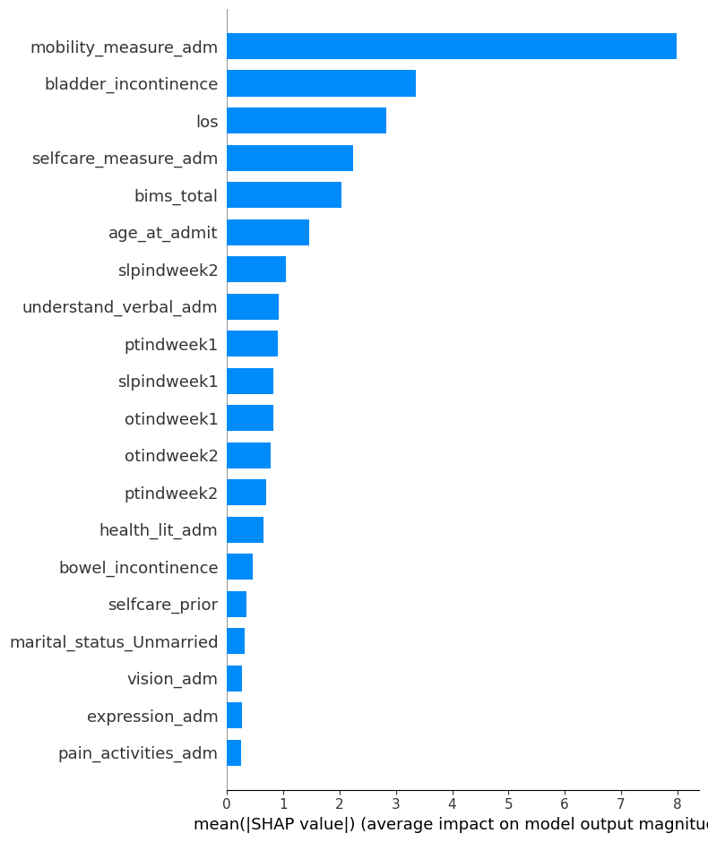
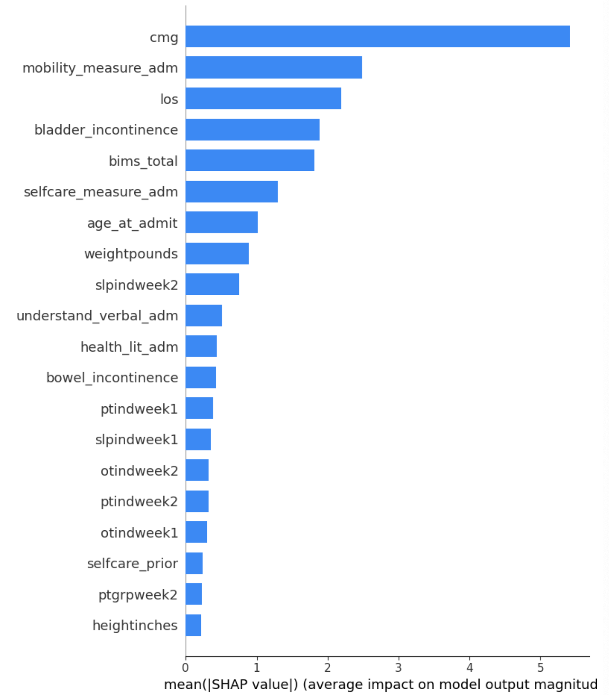

# Report 2024/11/18

Dingyi Nie

## 1 Update on included variables

Based on Dr. Cogan's `variable prioritization for model_11.14.2024.docx`, we've drastically decreased number of selected variables.

More modifications that differ from the previous processing pipeline include:

- `'race'` now follows [NINDS](https://www.ninds.nih.gov/taxonomy/term/758)'s grouping
- Note that `'age_at_admit'` is also included as an interested predictor which is not in the `.docx`
- `'pressure_ulcer_adm'`, `'low_interest_adm'` and `'depressed_adm'` are 3 newly added variables we previouly didn't have, the first one is treated as a binary variable and the rest two are categorical
- `'stroke_type'` is also included as a predictor, which is 3-categorical and is inferred from the diagnosis code in the raw data, according to [diagnostic codes_stroke type(diagnosis).csv](https://uscedu-my.sharepoint.com/:x:/r/personal/acogan_usc_edu/_layouts/15/Doc.aspx?sourcedoc=%7BA111644E-BA2D-44AA-B5BD-41C6B0F028B3%7D&file=diagnostic%20codes_stroke%20type.xlsx&action=default&mobileredirect=true) (if you are to run the jupyter code, remember to put this file under `./data/Data Preprocessing/` and run from section 1)
- Therapy doses predictors now only include independent ones from 3 departments and 2 weeks (6 in total)

```
total # of features: 38
+---------+------------------------+---------+
|   Index | Name                   | Dtype   |
+=========+========================+=========+
|       0 | selfcare_measure_delta | float64 |
+---------+------------------------+---------+
|       1 | mobility_measure_delta | float64 |
+---------+------------------------+---------+
|       2 | sex                    | object  |
+---------+------------------------+---------+
|       3 | marital_status         | object  |
+---------+------------------------+---------+
|       4 | payor_primary          | object  |
+---------+------------------------+---------+
|       5 | stroke_type            | object  |
+---------+------------------------+---------+
|       6 | ptindweek1             | float64 |
+---------+------------------------+---------+
|       7 | otindweek1             | float64 |
+---------+------------------------+---------+
|       8 | slpindweek1            | float64 |
+---------+------------------------+---------+
|       9 | ptindweek2             | float64 |
+---------+------------------------+---------+
|      10 | otindweek2             | float64 |
+---------+------------------------+---------+
|      11 | slpindweek2            | float64 |
+---------+------------------------+---------+
|      12 | hispanic               | object  |
+---------+------------------------+---------+
|      13 | race                   | object  |
+---------+------------------------+---------+
|      14 | hearing_adm            | Int64   |
+---------+------------------------+---------+
|      15 | vision_adm             | Int64   |
+---------+------------------------+---------+
|      16 | health_lit_adm         | Int64   |
+---------+------------------------+---------+
|      17 | expression_adm         | Int64   |
+---------+------------------------+---------+
|      18 | understand_verbal_adm  | Int64   |
+---------+------------------------+---------+
|      19 | bims_total             | Int64   |
+---------+------------------------+---------+
|      20 | acute_mental_change    | int64   |
+---------+------------------------+---------+
|      21 | low_interest_adm       | object  |
+---------+------------------------+---------+
|      22 | depressed_adm          | object  |
+---------+------------------------+---------+
|      23 | socisolation_adm       | Int64   |
+---------+------------------------+---------+
|      24 | selfcare_prior         | Int64   |
+---------+------------------------+---------+
|      25 | mobility_prior         | Int64   |
+---------+------------------------+---------+
|      26 | selfcare_measure_adm   | float64 |
+---------+------------------------+---------+
|      27 | mobility_measure_adm   | float64 |
+---------+------------------------+---------+
|      28 | bladder_incontinence   | Int64   |
+---------+------------------------+---------+
|      29 | bowel_incontinence     | Int64   |
+---------+------------------------+---------+
|      30 | pvd_comorbid           | int64   |
+---------+------------------------+---------+
|      31 | pain_sleep_adm         | Int64   |
+---------+------------------------+---------+
|      32 | pain_therapy_adm       | Int64   |
+---------+------------------------+---------+
|      33 | pain_activities_adm    | Int64   |
+---------+------------------------+---------+
|      34 | falls_hx               | object  |
+---------+------------------------+---------+
|      35 | pressure_ulcer_adm     | int64   |
+---------+------------------------+---------+
|      36 | age_at_admit           | float64 |
+---------+------------------------+---------+
|      37 | los                    | float64 |
+---------+------------------------+---------+

```

Based on previous drop-out strategy on these statistical criteria:

1. numeric features with a na_ratio > 0.3
2. numeric features with a std < 0.1
3. categorical features with a mode_ratio > 0.95

Actually none of the variables get eliminated. After one-hot expansion we have

```
total # of features: 49
+---------+------------------------------------------------+---------+-------------+
|   Index | Name                                           | Dtype   |   # of NaNs |
+=========+================================================+=========+=============+
|       0 | selfcare_measure_delta                         | float64 |           0 |
+---------+------------------------------------------------+---------+-------------+
|       1 | mobility_measure_delta                         | float64 |           0 |
+---------+------------------------------------------------+---------+-------------+
|       2 | ptindweek1                                     | float64 |           0 |
+---------+------------------------------------------------+---------+-------------+
|       3 | otindweek1                                     | float64 |           0 |
+---------+------------------------------------------------+---------+-------------+
|       4 | slpindweek1                                    | float64 |           0 |
+---------+------------------------------------------------+---------+-------------+
|       5 | ptindweek2                                     | float64 |           0 |
+---------+------------------------------------------------+---------+-------------+
|       6 | otindweek2                                     | float64 |           0 |
+---------+------------------------------------------------+---------+-------------+
|       7 | slpindweek2                                    | float64 |           0 |
+---------+------------------------------------------------+---------+-------------+
|       8 | hearing_adm                                    | int64   |           0 |
+---------+------------------------------------------------+---------+-------------+
|       9 | vision_adm                                     | int64   |           0 |
+---------+------------------------------------------------+---------+-------------+
|      10 | health_lit_adm                                 | float64 |        3453 |
+---------+------------------------------------------------+---------+-------------+
|      11 | expression_adm                                 | int64   |           0 |
+---------+------------------------------------------------+---------+-------------+
|      12 | understand_verbal_adm                          | int64   |           0 |
+---------+------------------------------------------------+---------+-------------+
|      13 | bims_total                                     | float64 |        4658 |
+---------+------------------------------------------------+---------+-------------+
|      14 | acute_mental_change                            | int64   |           0 |
+---------+------------------------------------------------+---------+-------------+
|      15 | socisolation_adm                               | float64 |        4138 |
+---------+------------------------------------------------+---------+-------------+
|      16 | selfcare_prior                                 | float64 |         275 |
+---------+------------------------------------------------+---------+-------------+
|      17 | mobility_prior                                 | float64 |         622 |
+---------+------------------------------------------------+---------+-------------+
|      18 | selfcare_measure_adm                           | float64 |           0 |
+---------+------------------------------------------------+---------+-------------+
|      19 | mobility_measure_adm                           | float64 |           0 |
+---------+------------------------------------------------+---------+-------------+
|      20 | bladder_incontinence                           | float64 |        2515 |
+---------+------------------------------------------------+---------+-------------+
|      21 | bowel_incontinence                             | float64 |        5852 |
+---------+------------------------------------------------+---------+-------------+
|      22 | pvd_comorbid                                   | int64   |           0 |
+---------+------------------------------------------------+---------+-------------+
|      23 | pain_sleep_adm                                 | int64   |           0 |
+---------+------------------------------------------------+---------+-------------+
|      24 | pain_therapy_adm                               | float64 |       12243 |
+---------+------------------------------------------------+---------+-------------+
|      25 | pain_activities_adm                            | float64 |       12243 |
+---------+------------------------------------------------+---------+-------------+
|      26 | pressure_ulcer_adm                             | int64   |           0 |
+---------+------------------------------------------------+---------+-------------+
|      27 | age_at_admit                                   | float64 |           0 |
+---------+------------------------------------------------+---------+-------------+
|      28 | los                                            | float64 |           0 |
+---------+------------------------------------------------+---------+-------------+
|      29 | sex_male                                       | int64   |           0 |
+---------+------------------------------------------------+---------+-------------+
|      30 | marital_status_Unknown                         | int64   |           0 |
+---------+------------------------------------------------+---------+-------------+
|      31 | marital_status_Unmarried                       | int64   |           0 |
+---------+------------------------------------------------+---------+-------------+
|      32 | payor_primary_Medicare_FFS                     | int64   |           0 |
+---------+------------------------------------------------+---------+-------------+
|      33 | payor_primary_Not_listed                       | int64   |           0 |
+---------+------------------------------------------------+---------+-------------+
|      34 | stroke_type_Ischemic                           | int64   |           0 |
+---------+------------------------------------------------+---------+-------------+
|      35 | stroke_type_Other                              | int64   |           0 |
+---------+------------------------------------------------+---------+-------------+
|      36 | hispanic_Yes                                   | int64   |           0 |
+---------+------------------------------------------------+---------+-------------+
|      37 | race_Asian                                     | int64   |           0 |
+---------+------------------------------------------------+---------+-------------+
|      38 | race_Black_or_African_American                 | int64   |           0 |
+---------+------------------------------------------------+---------+-------------+
|      39 | race_Multiracial                               | int64   |           0 |
+---------+------------------------------------------------+---------+-------------+
|      40 | race_Native_Hawaiian_or_Other_Pacific_Islander | int64   |           0 |
+---------+------------------------------------------------+---------+-------------+
|      41 | race_Unknown                                   | int64   |           0 |
+---------+------------------------------------------------+---------+-------------+
|      42 | race_White                                     | int64   |           0 |
+---------+------------------------------------------------+---------+-------------+
|      43 | low_interest_adm_1                             | int64   |           0 |
+---------+------------------------------------------------+---------+-------------+
|      44 | low_interest_adm_Unknown                       | int64   |           0 |
+---------+------------------------------------------------+---------+-------------+
|      45 | depressed_adm_1                                | int64   |           0 |
+---------+------------------------------------------------+---------+-------------+
|      46 | depressed_adm_Unknown                          | int64   |           0 |
+---------+------------------------------------------------+---------+-------------+
|      47 | falls_hx_Unknown                               | int64   |           0 |
+---------+------------------------------------------------+---------+-------------+
|      48 | falls_hx_Yes                                   | int64   |           0 |
+---------+------------------------------------------------+---------+-------------+
```

Which is the variable set our predictive models are going to work on.

Other parts of the preprocessings (MICE imputation, standardized normalization) pretty much stay the same.

## 2 Selfcare results

### 2.1 Linear regressor

```
----------train set results----------
MSE: 345.03192292015507
R²: 0.24283026453429812
----------eval set results----------
MSE: 337.66511389063197
R²: 0.2549032557866795
----------test set results----------
MSE: 340.19423933094663
R²: 0.24247959836438682

```

As a comparison (with our previous expansive variable set):

| Data split | MSE (new core var set) | MSE (previous expansive var set) | R square (new) | R square (previous) |
| ---------- | ---------------------- | -------------------------------- | -------------- | ------------------- |
| train      | 345.0                  | 314.7                            | 0.2428         | 0.3094              |
| eval       | 337.7                  | 304.9                            | 0.2549         | 0.3273              |
| test       | 340.2                  | 313.1                            | 0.2425         | 0.3028              |

We do see a predictive power loss here.

### 2.2 Random forest

```
----------train set results----------
MSE: 41.601896501597565
R²: 0.9087049780716215
----------eval set results----------
MSE: 290.7380066492272
R²: 0.35845329214680255
----------test set results----------
MSE: 295.39205618694007
R²: 0.3422419219009242

```

| Data split | MSE (new core var set) | MSE (previous expansive var set) | R square (new) | R square (previous) |
| ---------- | ---------------------- | -------------------------------- | -------------- | ------------------- |
| train      | 41.60                  | 41.10                            | 0.9087         | 0.9098              |
| eval       | 290.7                  | 286.8                            | 0.3585         | 0.3672              |
| test       | 295.4                  | 289.0                            | 0.3422         | 0.3566              |

For RF however, the performance didn't drop by a lot margin. This infers that the non-linear relationships in the core variable set are still meaningful but aren't captured by LR.

#### Shapley value test

A quick (approximated) SHAP test yields top 20 meaning ful variables are:



Previously on expansive variable set as a comparison:

