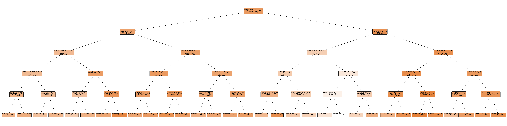

# Report 2024/12/08

Dingyi Nie

## 1 Categorical variables' case proportions

For all 9 categorical variables remaining after manual selection, here are the proportions of cases:

```
Feature: falls_hx
  No: 26714
  Yes: 13847
  Unknown: 2377
Feature: marital_status
  Unmarried: 20703
  Married: 19766
  Unknown: 2469
Feature: depressed_adm
  0: 31768
  1: 6529
  Unknown: 4641
Feature: payor_primary
  Medicare_FFS: 16063
  Not_listed: 14576
  Medicare_Advantage: 12299
Feature: hispanic
  No: 39745
  Yes: 3193
Feature: sex
  male: 22713
  female: 20225
Feature: stroke_type
  Ischemic: 35805
  Hemorrhagic: 6486
  Other: 647
Feature: low_interest_adm
  0: 33620
  1: 4741
  Unknown: 4577
Feature: race
  White: 29020
  Black_or_African_American: 9838
  Unknown: 2413
  Asian: 1321
  American_Indian_or_Alaska_Native: 176
  Multiracial: 89
  Native_Hawaiian_or_Other_Pacific_Islander: 81
```

We do not see any drastically low proportion case, except for `race`, where we follow [NINDS](https://www.ninds.nih.gov/taxonomy/term/758)'s grouping. It seems we can not reduce these categories any further, especially considering `Multiracial` is one of the smaller-proportion cases, and grouping it with the other few cases does not make sense logically.

## 2 Updated RF global summary trees

Selfcare:


Mobility:



## 3 Updated Lasso regression

Increased Lasso CV search of Alpha's grainularity. Now alpha is searched in

```Python
alpha_range = [0.001, 0.05, 0.03, 0.01, 0.5, 0.1, 0.5, 1, 5, 10, 50, 100]
```

For selfcare task, the best alpha found by CV is now 0.03.

Following 1-SE rule, for all alpha values that satisfy `mean_error <= min_error + min_error_se`, the largest is 0.1. Fit a new Lasso model on selfcare task with alpha = 0.1 yields the following results:

```
Best alpha (min error): 0.03
Alpha selected by 1SE rule: 0.1

---------- Train Set Results ----------
MSE: 346.2007
R²: 0.2403

---------- Eval Set Results ----------
MSE: 338.3352
R²: 0.2534

---------- Test Set Results ----------
MSE: 340.5518
R²: 0.2417

---------- Model Summary: Non-zero Coefficients ----------
                           Feature  Coefficient
0             mobility_measure_adm     6.830357
1                       ptindweek1     2.158104
2                       otindweek1     1.740079
3                       bims_total     1.499827
4                   selfcare_prior     1.122635
5            understand_verbal_adm     1.058634
6         marital_status_Unmarried     0.807883
7                       race_White     0.654775
8                      slpindweek1     0.519224
9                   mobility_prior     0.362948
10             pain_activities_adm     0.337819
11      payor_primary_Medicare_FFS     0.315076
12                             los     0.203444
13        payor_primary_Not_listed     0.183014
14                      vision_adm    -0.272099
15              bowel_incontinence    -0.283727
16             acute_mental_change    -0.392702
17  race_Black_or_African_American    -0.421941
18                      ptindweek2    -0.486597
19              pressure_ulcer_adm    -0.666926
20                  health_lit_adm    -0.765210
21                    falls_hx_Yes    -0.806571
22                        sex_male    -0.837267
23                    age_at_admit    -1.625570
24            selfcare_measure_adm    -2.542324
25            bladder_incontinence    -3.203255

```

Now number of variables reduce from 49 to 26.

For the mobility task, 1-SE rule also yields alpha = 0.1, and the results are as follows:

```
Best alpha (min error): 0.01
Alpha selected by 1SE rule: 0.1

---------- Train Set Results ----------
MSE: 344.2645
R²: 0.1851

---------- Eval Set Results ----------
MSE: 336.2865
R²: 0.2023

---------- Test Set Results ----------
MSE: 334.4508
R²: 0.1999

---------- Model Summary: Non-zero Coefficients ----------
                           Feature  Coefficient
0                       ptindweek1     2.238204
1             selfcare_measure_adm     2.041735
2             mobility_measure_adm     1.960027
3                       otindweek1     1.356835
4                      slpindweek1     1.273856
5                   selfcare_prior     0.906201
6         payor_primary_Not_listed     0.850155
7                       bims_total     0.767928
8                   mobility_prior     0.682834
9            understand_verbal_adm     0.626199
10                      race_White     0.605145
11        marital_status_Unmarried     0.351502
12                             los     0.221773
13             pain_activities_adm     0.184571
14                     slpindweek2     0.000979
15                    pvd_comorbid    -0.121013
16  race_Black_or_African_American    -0.304452
17                      otindweek2    -0.304661
18              bowel_incontinence    -0.423265
19                      vision_adm    -0.448847
20                      ptindweek2    -0.530227
21                  health_lit_adm    -0.667423
22              pressure_ulcer_adm    -0.821829
23                    age_at_admit    -1.428901
24                    falls_hx_Yes    -1.470242
25            bladder_incontinence    -2.615774
```

## 4 Updated modeling with interaction terms

Now, before creating interaction terms, OT/PT/SLP are combined for week1 and week2 respectively, hence only two combined variables (`sumindweek1` and `sumindweek2`) will be interacting with the rest of the variables.

After adding interaction terms to the data, rerun the forementioned Lasso experiments with 1-SE rule, the results are as follows:

Selfcare:

```
Best alpha (min error): 0.03
Alpha selected by 1SE rule: 0.1

---------- Train Set Results ----------
MSE: 327.2569
R²: 0.2818

---------- Eval Set Results ----------
MSE: 322.7168
R²: 0.2879

---------- Test Set Results ----------
MSE: 321.1996
R²: 0.2848

---------- Model Summary: Non-zero Coefficients ----------
                                 Feature  Coefficient
0                   mobility_measure_adm     6.303209
1                             bims_total     1.681771
2                  understand_verbal_adm     1.157852
3                         selfcare_prior     1.115792
4               marital_status_Unmarried     0.726547
5                            sumindweek1     0.578239
6     sumindweek1_x_mobility_measure_adm     0.525772
7     sumindweek2_x_bladder_incontinence     0.462465
8                                    los     0.430909
9                         mobility_prior     0.414889
10                            race_White     0.394299
11     sumindweek2_x_acute_mental_change     0.321403
12    sumindweek1_x_selfcare_measure_adm     0.287278
13              sumindweek1_x_bims_total     0.226504
14                   pain_activities_adm     0.213853
15   sumindweek1_x_understand_verbal_adm     0.203225
16      sumindweek2_x_pressure_ulcer_adm     0.162224
17                sumindweek1_x_sex_male     0.150836
18            sumindweek2_x_falls_hx_Yes     0.133327
19          sumindweek2_x_health_lit_adm     0.126407
20  sumindweek1_x_marital_status_Unknown     0.116839
21                        expression_adm     0.058529
22          sumindweek1_x_expression_adm     0.052702
23            payor_primary_Medicare_FFS     0.052049
24          sumindweek1_x_mobility_prior     0.045845
25     sumindweek2_x_pain_activities_adm     0.036738
26    sumindweek2_x_selfcare_measure_adm     0.032978
27                sumindweek2_x_sex_male     0.022398
28          sumindweek1_x_selfcare_prior     0.017972
29          sumindweek2_x_selfcare_prior     0.010290
30             sumindweek2_x_sumindweek1    -0.002467
31              sumindweek1_x_vision_adm    -0.004501
32        sumindweek2_x_socisolation_adm    -0.015323
33        sumindweek1_x_socisolation_adm    -0.041551
34          sumindweek1_x_health_lit_adm    -0.053187
35            sumindweek2_x_age_at_admit    -0.118749
36            sumindweek1_x_age_at_admit    -0.125633
37              sumindweek2_x_race_White    -0.168922
38                           sumindweek2    -0.187202
39    sumindweek1_x_bladder_incontinence    -0.187727
40                            vision_adm    -0.301072
41    sumindweek2_x_stroke_type_Ischemic    -0.304803
42              sumindweek2_x_bims_total    -0.346274
43             sumindweek1_x_sumindweek2    -0.353788
44   sumindweek2_x_understand_verbal_adm    -0.382435
45                    bowel_incontinence    -0.558118
46    sumindweek2_x_mobility_measure_adm    -0.603572
47                          falls_hx_Yes    -0.650124
48        race_Black_or_African_American    -0.719531
49                              sex_male    -0.736162
50                   acute_mental_change    -0.753878
51                        health_lit_adm    -0.808181
52                    pressure_ulcer_adm    -0.843482
53                     sumindweek2_x_los    -0.996046
54                          age_at_admit    -1.687008
55                  selfcare_measure_adm    -2.586528
56                  bladder_incontinence    -3.211919

```

Mobility:

```
Best alpha (min error): 0.03
Alpha selected by 1SE rule: 0.1

---------- Train Set Results ----------
MSE: 325.2945
R²: 0.2300

---------- Eval Set Results ----------
MSE: 321.9947
R²: 0.2362

---------- Test Set Results ----------
MSE: 316.1936
R²: 0.2436

---------- Model Summary: Non-zero Coefficients ----------
                                     Feature  Coefficient
0                       selfcare_measure_adm     1.882533
1                       mobility_measure_adm     1.461744
2                             selfcare_prior     0.933889
3                                 bims_total     0.868202
4         sumindweek1_x_mobility_measure_adm     0.770175
5                             mobility_prior     0.768207
6                   payor_primary_Not_listed     0.676640
7                      understand_verbal_adm     0.664408
8                                sumindweek1     0.632398
9         sumindweek2_x_bladder_incontinence     0.393663
10         sumindweek2_x_acute_mental_change     0.358847
11                  marital_status_Unmarried     0.299967
12                sumindweek2_x_falls_hx_Yes     0.248308
13                                race_White     0.217153
14                                       los     0.175723
15              sumindweek2_x_health_lit_adm     0.170146
16        sumindweek1_x_selfcare_measure_adm     0.159483
17      sumindweek2_x_marital_status_Unknown     0.145298
18       sumindweek1_x_understand_verbal_adm     0.136549
19          sumindweek2_x_pressure_ulcer_adm     0.129064
20                    sumindweek1_x_sex_male     0.110202
21                  sumindweek1_x_bims_total     0.108379
22              sumindweek1_x_mobility_prior     0.094699
23                sumindweek2_x_age_at_admit     0.068384
24                       pain_activities_adm     0.053893
25                sumindweek1_x_hispanic_Yes     0.044573
26        sumindweek2_x_selfcare_measure_adm     0.034050
27              sumindweek1_x_expression_adm     0.031052
28                  sumindweek2_x_vision_adm     0.016671
29              sumindweek2_x_pain_sleep_adm     0.013657
30              sumindweek2_x_expression_adm     0.004204
31          sumindweek1_x_bowel_incontinence    -0.000132
32                 sumindweek2_x_sumindweek1    -0.003778
33                 sumindweek1_x_hearing_adm    -0.024736
34              sumindweek2_x_mobility_prior    -0.033383
35                  sumindweek1_x_vision_adm    -0.045027
36                         sumindweek1_x_los    -0.049604
37                  sumindweek2_x_race_White    -0.052906
38            sumindweek2_x_socisolation_adm    -0.059858
39              sumindweek1_x_health_lit_adm    -0.071914
40                       acute_mental_change    -0.078821
41  sumindweek2_x_payor_primary_Medicare_FFS    -0.102238
42        sumindweek1_x_bladder_incontinence    -0.135312
43                sumindweek1_x_falls_hx_Yes    -0.160446
44                sumindweek1_x_age_at_admit    -0.220517
45                  sumindweek2_x_bims_total    -0.276977
46                 sumindweek1_x_sumindweek2    -0.321876
47       sumindweek2_x_understand_verbal_adm    -0.380237
48        sumindweek2_x_stroke_type_Ischemic    -0.420057
49                                vision_adm    -0.487702
50            race_Black_or_African_American    -0.625619
51                            health_lit_adm    -0.701054
52                        bowel_incontinence    -0.707825
53                         sumindweek2_x_los    -0.761137
54        sumindweek2_x_mobility_measure_adm    -0.820422
55                        pressure_ulcer_adm    -0.915766
56                              falls_hx_Yes    -1.365534
57                              age_at_admit    -1.512892
58                      bladder_incontinence    -2.650849

```

We've managed to reduce the number of variables (including interaction terms) down to under 60, while keeping similar predictive power to our previous models.

## 5 Correlation matrix

Binary variables are removed, and only correlation absolute value >= 0.1 is highlighted:

