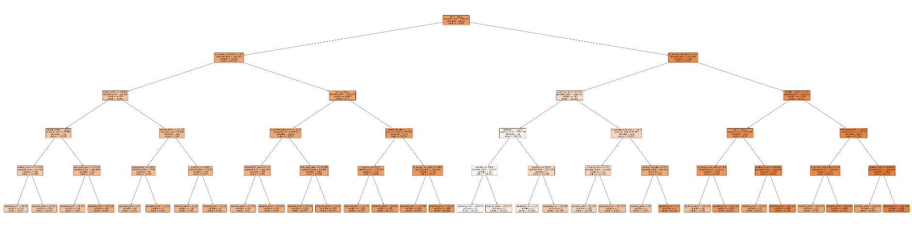
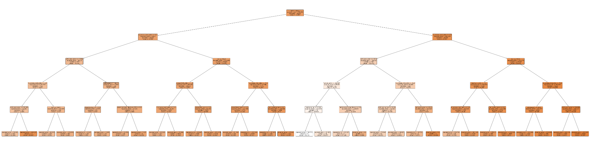

# Follow-up Summary 10/23

Dingyi Nie

## 1 Statistical Summary (LR)

### Selfcare

```
 OLS Regression Results                              
==================================================================================
Dep. Variable:     selfcare_measure_delta   R-squared:                       0.312
Model:                                OLS   Adj. R-squared:                  0.308
Method:                     Least Squares   F-statistic:                     81.05
Date:                    Wed, 23 Oct 2024   Prob (F-statistic):               0.00
Time:                            11:36:57   Log-Likelihood:            -1.2289e+05
No. Observations:                   28625   AIC:                         2.461e+05
Df Residuals:                       28465   BIC:                         2.474e+05
Df Model:                             159                                         
Covariance Type:                nonrobust                                         
======================================================================================================
                                         coef    std err          t      P>|t|      [0.025      0.975]
------------------------------------------------------------------------------------------------------
arthritis                              0.1244      1.470      0.085      0.933      -2.756       3.005
heightinches                           0.0391      0.034      1.165      0.244      -0.027       0.105
weightpounds                           0.0298      0.003     11.110      0.000       0.025       0.035
ptindweek1                             0.0259      0.001     17.822      0.000       0.023       0.029
ptconweek1                             0.0345      0.007      5.202      0.000       0.021       0.047
ptgrpweek1                             0.0429      0.004     10.718      0.000       0.035       0.051
ptcoweek1                              0.0300      0.016      1.896      0.058      -0.001       0.061
otindweek1                             0.0207      0.001     13.874      0.000       0.018       0.024
otconweek1                             0.0384      0.008      4.907      0.000       0.023       0.054
otgrpweek1                             0.0301      0.004      7.478      0.000       0.022       0.038
otcoweek1                             -0.0017      0.016     -0.103      0.918      -0.033       0.030
slpindweek1                            0.0101      0.002      6.469      0.000       0.007       0.013
slpconweek1                            0.0775      0.024      3.252      0.001       0.031       0.124
slpgrpweek1                            0.0104      0.007      1.584      0.113      -0.002       0.023
slpcoweek1                             0.0083      0.024      0.350      0.726      -0.038       0.054
ptindweek2                            -0.0008      0.001     -0.555      0.579      -0.003       0.002
ptconweek2                             0.0063      0.006      0.986      0.324      -0.006       0.019
ptgrpweek2                             0.0168      0.003      5.200      0.000       0.010       0.023
ptcoweek2                             -0.0083      0.014     -0.606      0.545      -0.035       0.019
otindweek2                             0.0015      0.001      1.115      0.265      -0.001       0.004
otconweek2                             0.0084      0.007      1.209      0.227      -0.005       0.022
otgrpweek2                             0.0149      0.003      4.575      0.000       0.009       0.021
otcoweek2                              0.0080      0.014      0.574      0.566      -0.019       0.035
slpindweek2                            0.0007      0.001      0.517      0.605      -0.002       0.003
slpconweek2                           -0.0160      0.018     -0.910      0.363      -0.051       0.019
slpgrpweek2                            0.0060      0.005      1.207      0.227      -0.004       0.016
slpcoweek2                             0.0137      0.017      0.797      0.426      -0.020       0.048
hearing_adm                           -0.1954      0.183     -1.066      0.286      -0.555       0.164
vision_adm                            -0.6138      0.145     -4.221      0.000      -0.899      -0.329
health_lit_adm                        -0.5333      0.091     -5.870      0.000      -0.711      -0.355
expression_adm                         0.1729      0.205      0.845      0.398      -0.228       0.574
understand_verbal_adm                  1.0445      0.228      4.580      0.000       0.597       1.491
conduct_bims                          -0.0659      0.852     -0.077      0.938      -1.736       1.604
bims_total                             0.4221      0.038     11.093      0.000       0.348       0.497
conduct_sams                          -3.6468      1.471     -2.479      0.013      -6.530      -0.763
sams_season                            2.4541      1.039      2.361      0.018       0.417       4.491
sams_room                             -2.3606      1.515     -1.558      0.119      -5.330       0.609
sams_names                            -1.3983      1.217     -1.149      0.250      -3.783       0.986
sams_hosp                              0.9486      0.753      1.260      0.208      -0.527       2.424
acute_mental_change                   -0.1330      0.302     -0.441      0.659      -0.724       0.458
mood_total_adm                         0.0463      0.047      0.986      0.324      -0.046       0.138
socisolation_adm                      -0.1119      0.151     -0.742      0.458      -0.408       0.184
selfcare_prior                         2.6212      0.439      5.969      0.000       1.760       3.482
mobility_prior                         0.1944      0.516      0.377      0.706      -0.817       1.205
stairs_prior                           1.0208      0.407      2.505      0.012       0.222       1.819
func_cog_prior                         0.2084      0.350      0.595      0.552      -0.478       0.894
wc_manual_prior                       -0.2225      0.536     -0.415      0.678      -1.273       0.828
wc_motor_prior                        -1.1193      1.003     -1.116      0.265      -3.086       0.847
mechlift_prior                        -0.1218      1.642     -0.074      0.941      -3.341       3.097
walker_prior                          -1.1254      0.296     -3.805      0.000      -1.705      -0.546
orth_pros_prior                       -2.3878      1.191     -2.005      0.045      -4.722      -0.054
selfcare_measure_adm                  -0.7037      0.024    -28.753      0.000      -0.752      -0.656
mobility_measure_adm                   0.3439      0.023     14.875      0.000       0.299       0.389
wc_user                               -1.4110      0.566     -2.493      0.013      -2.520      -0.302
wheel50ft_adm                          0.4393      0.167      2.626      0.009       0.111       0.767
wheel150ft_adm                         0.2843      0.172      1.655      0.098      -0.052       0.621
bladder_incontinence                  -1.0617      0.089    -11.912      0.000      -1.236      -0.887
bowel_incontinence                    -0.0626      0.124     -0.505      0.613      -0.305       0.180
pvd_comorbid                          -0.4581      0.455     -1.006      0.314      -1.350       0.434
diabetes_comorbid                     -0.7043      0.352     -2.002      0.045      -1.394      -0.015
pain_sleep_adm                        -0.0275      0.111     -0.248      0.804      -0.245       0.190
pain_therapy_adm                      -0.2674      0.118     -2.261      0.024      -0.499      -0.036
pain_activities_adm                    0.4010      0.147      2.723      0.006       0.112       0.690
nutrition_parenteral_adm              -1.2668      1.383     -0.916      0.360      -3.977       1.443
nutrition_tube_adm                    -1.2212      0.495     -2.466      0.014      -2.192      -0.251
nutrition_mech_diet_adm               -1.7668      0.243     -7.284      0.000      -2.242      -1.291
nutrition_ther_diet_adm                0.3808      0.235      1.618      0.106      -0.081       0.842
stage1_pu_adm                         -0.0817      0.390     -0.209      0.834      -0.846       0.683
stage2_pu_adm                         -1.1916      0.490     -2.434      0.015      -2.151      -0.232
stage3_pu_adm                         -0.8934      0.907     -0.986      0.324      -2.670       0.883
stage4_pu_adm                         -3.1044      2.298     -1.351      0.177      -7.608       1.399
unstageable_dressing_pu_adm            0.0677      4.624      0.015      0.988      -8.995       9.130
unstageable_slough_pu_adm             -1.5477      0.564     -2.746      0.006      -2.652      -0.443
unstageable_deep_pu_adm               -0.3266      0.312     -1.048      0.295      -0.937       0.284
antipsychotic_taking_adm              -0.5765      1.672     -0.345      0.730      -3.853       2.701
antipsychotic_ind_adm                 -0.4950      1.707     -0.290      0.772      -3.841       2.851
anticoagulant_taking_adm              -1.5658      0.920     -1.702      0.089      -3.369       0.237
anticoagulant_ind_adm                  0.7767      0.910      0.853      0.394      -1.008       2.561
antibiotic_taking_adm                  1.6672      1.720      0.969      0.333      -1.705       5.040
antibiotic_ind_adm                    -1.7497      1.740     -1.005      0.315      -5.161       1.661
opioid_taking_adm                     -1.5393      1.963     -0.784      0.433      -5.386       2.308
opioid_ind_adm                         1.1673      1.972      0.592      0.554      -2.698       5.033
antiplatelet_taking_adm               -0.0372      0.735     -0.051      0.960      -1.479       1.404
antiplatelet_ind_adm                   0.2215      0.727      0.305      0.761      -1.203       1.646
hypoglycemic_taking_adm               -0.5086      1.111     -0.458      0.647      -2.686       1.669
hypoglycemic_ind_adm                   0.2651      1.094      0.242      0.809      -1.879       2.409
med_follow_up                         -0.2385      3.268     -0.073      0.942      -6.643       6.166
chemo_adm                             -2.4851      8.861     -0.280      0.779     -19.854      14.883
chemo_iv_adm                           3.2530      9.177      0.354      0.723     -14.735      21.241
chemo_oral_adm                         1.7094      8.848      0.193      0.847     -15.632      19.051
chemo_other_adm                        3.3634      8.650      0.389      0.697     -13.591      20.318
radiation_adm                         -6.5304      4.931     -1.324      0.185     -16.195       3.134
oxygen_adm                             0.9865      1.448      0.681      0.496      -1.852       3.825
oxygen_cont_adm                       -1.1464      1.380     -0.831      0.406      -3.851       1.558
oxygen_int_adm                        -0.4863      1.404     -0.346      0.729      -3.239       2.266
oxygen_high_adm                       -0.2779      2.217     -0.125      0.900      -4.622       4.067
suctioning_adm                        -5.6838      6.541     -0.869      0.385     -18.505       7.137
suctioning_sched_adm                   1.1560      5.469      0.211      0.833      -9.563      11.875
suctioning_asneeded_adm                3.7810      6.489      0.583      0.560      -8.938      16.500
trach_adm                              1.4469      1.581      0.915      0.360      -1.651       4.545
vent_invasive_adm                     -5.3211      5.216     -1.020      0.308     -15.544       4.902
vent_noninvasive_adm                   6.0438      5.821      1.038      0.299      -5.365      17.453
vent_bipap_adm                        -5.1552      5.658     -0.911      0.362     -16.246       5.935
vent_cpap_adm                         -4.6102      5.793     -0.796      0.426     -15.966       6.745
meds_iv_adm                            0.7845      1.078      0.728      0.467      -1.329       2.898
meds_iv_vasoactive_adm                -0.6375      1.374     -0.464      0.643      -3.332       2.057
meds_iv_antibiotic_adm                 1.0707      0.999      1.072      0.284      -0.886       3.028
meds_iv_anticoagulant_adm              0.3859      1.768      0.218      0.827      -3.080       3.852
meds_iv_other_adm                     -0.2729      0.996     -0.274      0.784      -2.226       1.680
transfusions_adm                       0.5492      2.438      0.225      0.822      -4.230       5.329
dialysis_adm                          -5.9581     10.569     -0.564      0.573     -26.673      14.757
hemodialysis_adm                       6.2546     10.509      0.595      0.552     -14.344      26.853
peritoneal_dialysis_adm                3.7593     10.335      0.364      0.716     -16.497      24.015
iv_access_adm                         -5.1983      1.457     -3.567      0.000      -8.054      -2.342
iv_access_periph_adm                   3.3480      1.432      2.338      0.019       0.541       6.155
iv_access_mid_adm                      4.0420      1.538      2.627      0.009       1.027       7.058
iv_access_cent_adm                     2.4346      1.411      1.726      0.084      -0.330       5.199
age_at_admit                          -0.1282      0.012    -10.882      0.000      -0.151      -0.105
los                                    0.0704      0.015      4.678      0.000       0.041       0.100
ric                                  484.9577     16.153     30.023      0.000     453.297     516.618
cmg                                   -4.6348      0.141    -32.795      0.000      -4.912      -4.358
sex_male                              -2.0991      0.286     -7.347      0.000      -2.659      -1.539
marital_status_Unknown                 0.7634      0.473      1.614      0.107      -0.164       1.691
marital_status_Unmarried               1.1426      0.227      5.027      0.000       0.697       1.588
admitclass_Other                     -11.0180      1.193     -9.234      0.000     -13.357      -8.679
admitclass_Readmission                -2.3897      0.575     -4.156      0.000      -3.517      -1.263
admitclass_Unknown                     2.1768      0.403      5.407      0.000       1.388       2.966
admit_from_Other_facility              0.2060      0.914      0.225      0.822      -1.585       1.997
admit_from_Short-term_hospital         1.5783      0.732      2.157      0.031       0.144       3.012
prehospital_living_Home               -0.2210      1.179     -0.187      0.851      -2.532       2.090
payor_primary_Medicare_FFS             0.9410      0.266      3.534      0.000       0.419       1.463
payor_primary_Not_listed               0.6020      0.331      1.820      0.069      -0.046       1.250
hispanic_Yes                           1.4272      0.483      2.956      0.003       0.481       2.373
race_Asian_Indian                      2.7219      1.993      1.366      0.172      -1.184       6.628
race_Black                            -0.1746      1.535     -0.114      0.909      -3.183       2.834
race_East_Asian                        0.4113      2.039      0.202      0.840      -3.584       4.407
race_Pacific_islander                 -1.0757      2.654     -0.405      0.685      -6.277       4.126
race_Southeast_Asian                   0.7727      1.715      0.451      0.652      -2.588       4.133
race_Unknown                           1.3052      1.587      0.822      0.411      -1.806       4.417
race_White                             1.2037      1.524      0.790      0.429      -1.783       4.190
language_Non-English                  -0.7462      0.545     -1.368      0.171      -1.815       0.323
transport_lack_Unknown                -0.3849      0.545     -0.706      0.480      -1.453       0.683
transport_lack_Yes                     0.5783      0.585      0.989      0.323      -0.568       1.725
inattention_adm_Fluctuates            -0.3696      0.577     -0.641      0.522      -1.500       0.761
inattention_adm_Not_present            0.8369      0.576      1.452      0.146      -0.293       1.967
disorganized_adm_Fluctuates           -0.4041      0.656     -0.616      0.538      -1.689       0.881
disorganized_adm_Not_present           0.2516      0.620      0.406      0.685      -0.963       1.467
altered_adm_Fluctuates                 0.6583      0.908      0.725      0.468      -1.121       2.437
altered_adm_Not_present               -0.4007      0.817     -0.490      0.624      -2.002       1.201
wc50_type_manual                      -1.1722      2.597     -0.451      0.652      -6.262       3.918
wc50_type_motorized                   -0.2388      2.727     -0.088      0.930      -5.583       5.106
wc150_type_manual                     -0.7136      2.580     -0.277      0.782      -5.770       4.343
wc150_type_motorized                  -0.6974      2.676     -0.261      0.794      -5.942       4.547
falls_hx_Unknown                      -0.8848      0.531     -1.666      0.096      -1.926       0.156
falls_hx_Yes                          -0.8591      0.236     -3.637      0.000      -1.322      -0.396
prior_surgery_Unknown                  0.3289      0.645      0.510      0.610      -0.936       1.593
prior_surgery_Yes                      0.0356      0.273      0.130      0.896      -0.500       0.571
drug_regimen_review_Not_applicable    -2.4735      1.206     -2.051      0.040      -4.837      -0.110
drug_regimen_review_Yes                0.3016      0.348      0.865      0.387      -0.381       0.985
tier_2                                -0.9704      1.277     -0.760      0.447      -3.474       1.533
tier_3                                -0.0666      0.925     -0.072      0.943      -1.880       1.747
tier_Unknown                           0.5600      0.937      0.598      0.550      -1.276       2.396
==============================================================================
Omnibus:                      159.503   Durbin-Watson:                   1.984
Prob(Omnibus):                  0.000   Jarque-Bera (JB):              221.882
Skew:                          -0.059   Prob(JB):                     6.59e-49
Kurtosis:                       3.415   Cond. No.                     1.00e+16
==============================================================================

Notes:
[1] Standard Errors assume that the covariance matrix of the errors is correctly specified.
[2] The smallest eigenvalue is 1.5e-22. This might indicate that there are
strong multicollinearity problems or that the design matrix is singular.
```

### Mobility

```
                              OLS Regression Results                              
==================================================================================
Dep. Variable:     mobility_measure_delta   R-squared:                       0.247
Model:                                OLS   Adj. R-squared:                  0.243
Method:                     Least Squares   F-statistic:                     58.82
Date:                    Wed, 23 Oct 2024   Prob (F-statistic):               0.00
Time:                            11:41:07   Log-Likelihood:            -1.2309e+05
No. Observations:                   28625   AIC:                         2.465e+05
Df Residuals:                       28465   BIC:                         2.478e+05
Df Model:                             159                                         
Covariance Type:                nonrobust                                         
======================================================================================================
                                         coef    std err          t      P>|t|      [0.025      0.975]
------------------------------------------------------------------------------------------------------
arthritis                             -0.0317      1.480     -0.021      0.983      -2.932       2.868
heightinches                          -0.0208      0.034     -0.617      0.537      -0.087       0.045
weightpounds                           0.0205      0.003      7.589      0.000       0.015       0.026
ptindweek1                             0.0269      0.001     18.369      0.000       0.024       0.030
ptconweek1                             0.0242      0.007      3.634      0.000       0.011       0.037
ptgrpweek1                             0.0496      0.004     12.321      0.000       0.042       0.058
ptcoweek1                              0.0253      0.016      1.589      0.112      -0.006       0.057
otindweek1                             0.0171      0.002     11.367      0.000       0.014       0.020
otconweek1                             0.0241      0.008      3.055      0.002       0.009       0.039
otgrpweek1                             0.0325      0.004      8.023      0.000       0.025       0.040
otcoweek1                              0.0053      0.016      0.329      0.742      -0.026       0.037
slpindweek1                            0.0144      0.002      9.195      0.000       0.011       0.017
slpconweek1                            0.0679      0.024      2.830      0.005       0.021       0.115
slpgrpweek1                            0.0207      0.007      3.122      0.002       0.008       0.034
slpcoweek1                            -0.0089      0.024     -0.376      0.707      -0.055       0.038
ptindweek2                            -0.0013      0.001     -0.941      0.347      -0.004       0.001
ptconweek2                             0.0049      0.006      0.755      0.450      -0.008       0.018
ptgrpweek2                             0.0163      0.003      5.008      0.000       0.010       0.023
ptcoweek2                              0.0002      0.014      0.012      0.990      -0.027       0.027
otindweek2                            -0.0017      0.001     -1.195      0.232      -0.004       0.001
otconweek2                            -0.0006      0.007     -0.083      0.934      -0.014       0.013
otgrpweek2                             0.0074      0.003      2.249      0.025       0.001       0.014
otcoweek2                             -0.0131      0.014     -0.928      0.354      -0.041       0.015
slpindweek2                            0.0027      0.001      1.939      0.053   -3.01e-05       0.006
slpconweek2                           -0.0184      0.018     -1.040      0.299      -0.053       0.016
slpgrpweek2                           -0.0021      0.005     -0.414      0.679      -0.012       0.008
slpcoweek2                             0.0261      0.017      1.506      0.132      -0.008       0.060
hearing_adm                           -0.0459      0.185     -0.249      0.803      -0.408       0.316
vision_adm                            -0.7678      0.146     -5.244      0.000      -1.055      -0.481
health_lit_adm                        -0.4325      0.091     -4.729      0.000      -0.612      -0.253
expression_adm                        -0.0962      0.206     -0.467      0.641      -0.500       0.308
understand_verbal_adm                  0.8228      0.230      3.583      0.000       0.373       1.273
conduct_bims                           0.2259      0.858      0.263      0.792      -1.456       1.907
bims_total                             0.2537      0.038      6.621      0.000       0.179       0.329
conduct_sams                          -2.2178      1.481     -1.497      0.134      -5.121       0.686
sams_season                            1.8027      1.046      1.723      0.085      -0.248       3.854
sams_room                             -3.2511      1.525     -2.131      0.033      -6.241      -0.261
sams_names                            -0.8687      1.225     -0.709      0.478      -3.270       1.532
sams_hosp                              1.2370      0.758      1.632      0.103      -0.249       2.723
acute_mental_change                    0.0872      0.304      0.287      0.774      -0.508       0.682
mood_total_adm                        -0.0087      0.047     -0.185      0.853      -0.101       0.084
socisolation_adm                      -0.0039      0.152     -0.026      0.980      -0.302       0.294
selfcare_prior                         1.5207      0.442      3.440      0.001       0.654       2.387
mobility_prior                         0.6158      0.519      1.186      0.236      -0.402       1.634
stairs_prior                           0.7692      0.410      1.875      0.061      -0.035       1.573
func_cog_prior                         0.0300      0.352      0.085      0.932      -0.661       0.721
wc_manual_prior                       -1.4733      0.539     -2.731      0.006      -2.531      -0.416
wc_motor_prior                        -2.8807      1.010     -2.851      0.004      -4.861      -0.901
mechlift_prior                        -0.1678      1.654     -0.101      0.919      -3.409       3.074
walker_prior                          -2.3095      0.298     -7.755      0.000      -2.893      -1.726
orth_pros_prior                       -2.8079      1.199     -2.342      0.019      -5.158      -0.458
selfcare_measure_adm                   0.0464      0.025      1.882      0.060      -0.002       0.095
mobility_measure_adm                  -0.1741      0.023     -7.481      0.000      -0.220      -0.129
wc_user                               -2.2699      0.570     -3.984      0.000      -3.387      -1.153
wheel50ft_adm                          0.1006      0.168      0.597      0.550      -0.230       0.431
wheel150ft_adm                         0.4201      0.173      2.429      0.015       0.081       0.759
bladder_incontinence                  -0.7999      0.090     -8.913      0.000      -0.976      -0.624
bowel_incontinence                    -0.2001      0.125     -1.605      0.109      -0.445       0.044
pvd_comorbid                          -0.7746      0.458     -1.690      0.091      -1.673       0.124
diabetes_comorbid                     -1.1395      0.354     -3.217      0.001      -1.834      -0.445
pain_sleep_adm                         0.0220      0.112      0.197      0.844      -0.197       0.241
pain_therapy_adm                      -0.2656      0.119     -2.230      0.026      -0.499      -0.032
pain_activities_adm                    0.3001      0.148      2.024      0.043       0.010       0.591
nutrition_parenteral_adm              -0.6158      1.392     -0.442      0.658      -3.344       2.113
nutrition_tube_adm                    -0.3206      0.499     -0.643      0.520      -1.298       0.657
nutrition_mech_diet_adm               -1.2038      0.244     -4.928      0.000      -1.683      -0.725
nutrition_ther_diet_adm                0.4415      0.237      1.863      0.063      -0.023       0.906
stage1_pu_adm                         -0.5321      0.393     -1.355      0.176      -1.302       0.238
stage2_pu_adm                         -0.8360      0.493     -1.696      0.090      -1.802       0.130
stage3_pu_adm                         -0.3826      0.913     -0.419      0.675      -2.172       1.406
stage4_pu_adm                         -2.5111      2.313     -1.085      0.278      -7.046       2.023
unstageable_dressing_pu_adm            0.2798      4.655      0.060      0.952      -8.845       9.405
unstageable_slough_pu_adm             -1.1730      0.567     -2.067      0.039      -2.285      -0.061
unstageable_deep_pu_adm               -0.3997      0.314     -1.274      0.203      -1.015       0.215
antipsychotic_taking_adm              -1.1496      1.683     -0.683      0.495      -4.449       2.150
antipsychotic_ind_adm                  0.5011      1.719      0.292      0.771      -2.868       3.870
anticoagulant_taking_adm              -0.6277      0.926     -0.678      0.498      -2.443       1.188
anticoagulant_ind_adm                  0.3936      0.917      0.429      0.668      -1.403       2.190
antibiotic_taking_adm                  2.4916      1.732      1.438      0.150      -0.904       5.887
antibiotic_ind_adm                    -2.5605      1.752     -1.461      0.144      -5.995       0.874
opioid_taking_adm                     -1.1150      1.976     -0.564      0.573      -4.988       2.758
opioid_ind_adm                         0.3019      1.986      0.152      0.879      -3.590       4.194
antiplatelet_taking_adm                0.2871      0.740      0.388      0.698      -1.164       1.738
antiplatelet_ind_adm                  -0.1302      0.732     -0.178      0.859      -1.565       1.304
hypoglycemic_taking_adm               -0.2953      1.119     -0.264      0.792      -2.488       1.898
hypoglycemic_ind_adm                  -0.0396      1.102     -0.036      0.971      -2.199       2.120
med_follow_up                         -1.2126      3.290     -0.369      0.712      -7.661       5.236
chemo_adm                              1.6014      8.922      0.179      0.858     -15.887      19.089
chemo_iv_adm                           3.0178      9.241      0.327      0.744     -15.094      21.130
chemo_oral_adm                        -2.1335      8.909     -0.239      0.811     -19.595      15.328
chemo_other_adm                       -0.2502      8.710     -0.029      0.977     -17.322      16.821
radiation_adm                         -3.2740      4.965     -0.659      0.510     -13.005       6.457
oxygen_adm                             1.6952      1.458      1.162      0.245      -1.163       4.553
oxygen_cont_adm                       -1.9941      1.389     -1.435      0.151      -4.717       0.729
oxygen_int_adm                        -1.0023      1.414     -0.709      0.478      -3.774       1.769
oxygen_high_adm                        0.2544      2.232      0.114      0.909      -4.120       4.629
suctioning_adm                         1.3561      6.586      0.206      0.837     -11.553      14.266
suctioning_sched_adm                  -3.8688      5.507     -0.703      0.482     -14.662       6.924
suctioning_asneeded_adm               -3.1393      6.534     -0.480      0.631     -15.946       9.668
trach_adm                              1.0456      1.592      0.657      0.511      -2.074       4.165
vent_invasive_adm                     -5.8022      5.252     -1.105      0.269     -16.096       4.491
vent_noninvasive_adm                   5.2806      5.861      0.901      0.368      -6.207      16.768
vent_bipap_adm                        -4.0551      5.697     -0.712      0.477     -15.222       7.112
vent_cpap_adm                         -3.6481      5.833     -0.625      0.532     -15.082       7.786
meds_iv_adm                            0.7460      1.086      0.687      0.492      -1.382       2.874
meds_iv_vasoactive_adm                -2.5361      1.384     -1.832      0.067      -5.249       0.177
meds_iv_antibiotic_adm                -0.1342      1.005     -0.134      0.894      -2.105       1.836
meds_iv_anticoagulant_adm              0.0450      1.781      0.025      0.980      -3.445       3.535
meds_iv_other_adm                     -0.1570      1.003     -0.157      0.876      -2.123       1.809
transfusions_adm                       3.0920      2.455      1.259      0.208      -1.720       7.904
dialysis_adm                           2.0099     10.642      0.189      0.850     -18.848      22.868
hemodialysis_adm                      -2.6468     10.581     -0.250      0.802     -23.387      18.093
peritoneal_dialysis_adm               -4.3735     10.406     -0.420      0.674     -24.769      16.022
iv_access_adm                         -3.9865      1.467     -2.717      0.007      -6.862      -1.111
iv_access_periph_adm                   2.0955      1.442      1.453      0.146      -0.730       4.921
iv_access_mid_adm                      2.9148      1.549      1.882      0.060      -0.122       5.951
iv_access_cent_adm                     2.4054      1.420      1.694      0.090      -0.378       5.189
age_at_admit                          -0.1197      0.012    -10.091      0.000      -0.143      -0.096
los                                    0.0610      0.015      4.025      0.000       0.031       0.091
ric                                  377.0653     16.264     23.184      0.000     345.187     408.944
cmg                                   -3.6466      0.142    -25.627      0.000      -3.926      -3.368
sex_male                              -0.4848      0.288     -1.685      0.092      -1.049       0.079
marital_status_Unknown                -0.0378      0.476     -0.079      0.937      -0.972       0.896
marital_status_Unmarried               0.6648      0.229      2.904      0.004       0.216       1.113
admitclass_Other                     -11.4504      1.201     -9.531      0.000     -13.805      -9.096
admitclass_Readmission                -3.1750      0.579     -5.485      0.000      -4.310      -2.040
admitclass_Unknown                     1.3543      0.405      3.341      0.001       0.560       2.149
admit_from_Other_facility             -0.4561      0.920     -0.496      0.620      -2.260       1.348
admit_from_Short-term_hospital         2.4792      0.737      3.365      0.001       1.035       3.923
prehospital_living_Home               -1.8330      1.187     -1.544      0.123      -4.160       0.494
payor_primary_Medicare_FFS             0.7480      0.268      2.790      0.005       0.222       1.274
payor_primary_Not_listed               1.1197      0.333      3.362      0.001       0.467       1.772
hispanic_Yes                           1.8756      0.486      3.859      0.000       0.923       2.828
race_Asian_Indian                      5.4474      2.006      2.715      0.007       1.515       9.380
race_Black                             1.4195      1.545      0.919      0.358      -1.609       4.448
race_East_Asian                        1.2017      2.053      0.585      0.558      -2.821       5.225
race_Pacific_islander                  1.6519      2.672      0.618      0.536      -3.586       6.889
race_Southeast_Asian                   2.4769      1.726      1.435      0.151      -0.907       5.861
race_Unknown                           1.6584      1.598      1.038      0.299      -1.474       4.791
race_White                             2.4006      1.534      1.565      0.118      -0.606       5.407
language_Non-English                  -0.5503      0.549     -1.002      0.316      -1.627       0.526
transport_lack_Unknown                -0.5519      0.549     -1.006      0.315      -1.627       0.524
transport_lack_Yes                    -0.6741      0.589     -1.145      0.252      -1.828       0.480
inattention_adm_Fluctuates            -0.2823      0.581     -0.486      0.627      -1.421       0.856
inattention_adm_Not_present            0.4832      0.580      0.833      0.405      -0.654       1.621
disorganized_adm_Fluctuates           -0.7319      0.660     -1.109      0.268      -2.026       0.562
disorganized_adm_Not_present          -0.0611      0.624     -0.098      0.922      -1.285       1.162
altered_adm_Fluctuates                 0.5981      0.914      0.654      0.513      -1.193       2.390
altered_adm_Not_present               -0.2462      0.823     -0.299      0.765      -1.859       1.366
wc50_type_manual                      -2.7490      2.615     -1.051      0.293      -7.874       2.376
wc50_type_motorized                    0.4791      2.745      0.175      0.861      -4.902       5.860
wc150_type_manual                      1.4284      2.598      0.550      0.582      -3.663       6.520
wc150_type_motorized                  -3.6982      2.694     -1.373      0.170      -8.979       1.583
falls_hx_Unknown                      -1.1876      0.535     -2.221      0.026      -2.236      -0.139
falls_hx_Yes                          -1.4132      0.238     -5.942      0.000      -1.879      -0.947
prior_surgery_Unknown                 -0.0820      0.650     -0.126      0.900      -1.355       1.191
prior_surgery_Yes                      0.4283      0.275      1.558      0.119      -0.111       0.967
drug_regimen_review_Not_applicable    -1.2172      1.214     -1.003      0.316      -3.597       1.162
drug_regimen_review_Yes                0.6555      0.351      1.868      0.062      -0.032       1.343
tier_2                                -0.2619      1.286     -0.204      0.839      -2.782       2.259
tier_3                                 0.8411      0.931      0.903      0.367      -0.985       2.667
tier_Unknown                           1.5200      0.943      1.612      0.107      -0.328       3.368
==============================================================================
Omnibus:                     1191.400   Durbin-Watson:                   2.020
Prob(Omnibus):                  0.000   Jarque-Bera (JB):             2048.836
Skew:                           0.351   Prob(JB):                         0.00
Kurtosis:                       4.107   Cond. No.                     1.00e+16
==============================================================================

Notes:
[1] Standard Errors assume that the covariance matrix of the errors is correctly specified.
[2] The smallest eigenvalue is 1.5e-22. This might indicate that there are
strong multicollinearity problems or that the design matrix is singular.
```

## 2 Gloabal Summary Tree (RF)

Depth = 5

### Selfcare



### Mobility

