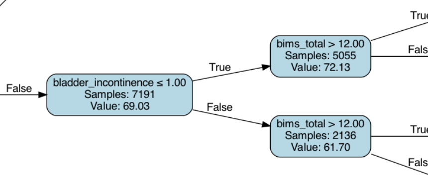
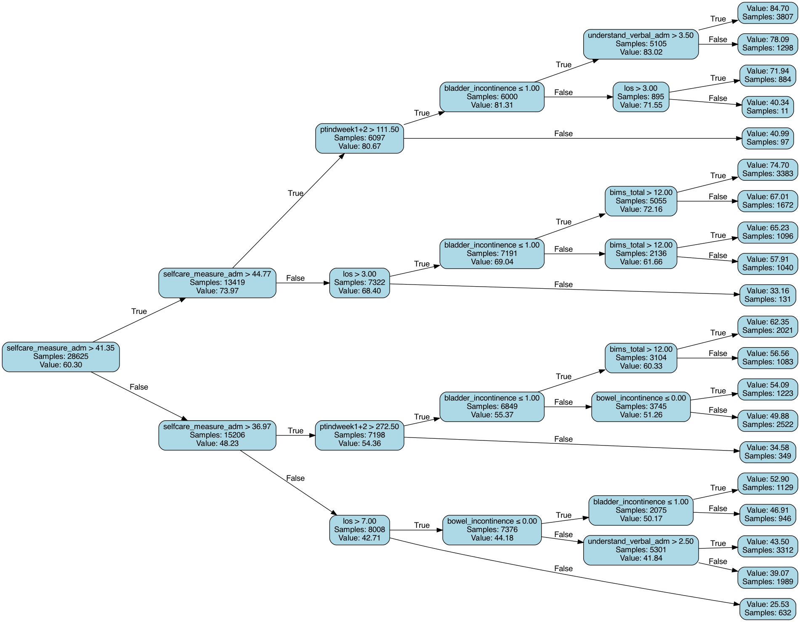
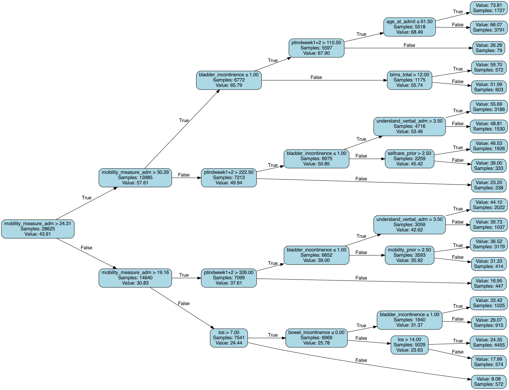
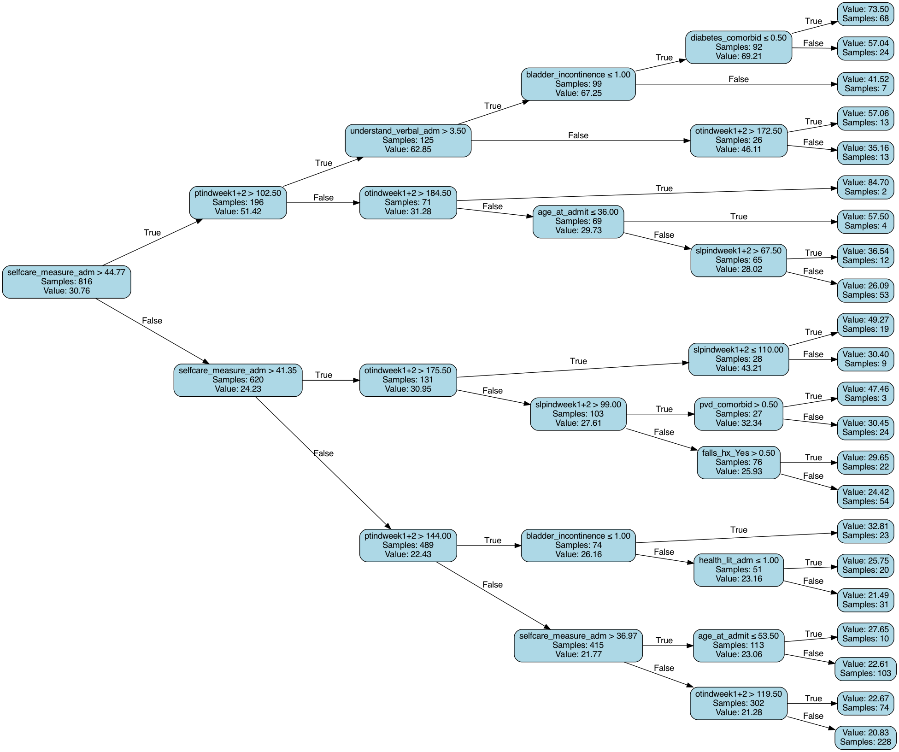

# Results 2/27

Dingyi Nie

## 0 Experiment Settings

All results in this document are under following settings:

- For therapy hours, we use total amount (`['ptindweek1+2', 'otindweek1+2', 'slpindweek1+2']`) as predictors

- For selfcare outcome prediction, mobility function at admission is excluded from the predictors; vice versa

- The following predictors have been binned at clinically meaningful cutpoints:

  ```python
  cm_ri_cutpoints = { # clinically meaningful ranked int variables
      "hearing_adm": [1], # ['Adequate' 'Min_difficulty' | 'Mod_difficulty' 'Highly_impaired']
      "vision_adm": [1], # ['Adequate' 'Impaired'(typo, should be Not_impaired) | 'Mod_impaired' 'Highly_impaired' 'Severely_impaired']
      "health_lit_adm": [1], # ['Never' 'Rarely' | 'Sometimes' 'Often' 'Always'], ['Decline' 'Unable'] are NaN
      "socisolation_adm": [1], # ['Never' 'Rarely' | 'Sometimes' 'Often' 'Always'], ['Decline' 'Unable'] are NaN
      "bims_total": [7, 12], # NaN exists
      "bladder_incontinence": [1], # ['Continent' 'Stress_incont' | 'Incont_weekly' 'Incont_daily' 'Incontinent'], ['Not_applicable', 'No_output'] are NaN
      "bowel_incontinence": [0], # ['Continent' | 'Occ_incont' 'Freq_incont' 'Incontinent'], 'Not_rated' is NaN
      "pain_sleep_adm": [1], # ['does_not_apply' 'Rarely' | 'occasionally' 'frequently' 'constantly'], 'unable' is NaN
      "pain_therapy_adm": [1], # ['does_not_apply' 'Rarely' | 'occasionally' 'frequently' 'constantly'], 'unable' is NaN
      "pain_activities_adm": [1], # ['does_not_apply' 'Rarely' | 'occasionally' 'frequently' 'constantly'], 'unable' is NaN
  }
  # besides above, we have:
      # "los": # 1/2 week, 1 week, 2 weeks, >2 weeks
      # "selfcare_measure_adm", # quartiles
      # "mobility_measure_adm", # quartiles
  los_cutpoints = [3, 7, 14]
  ```

  **How to understand this?**

  Let's take `"bladder_incontinence": [1], # ['Continent' 'Stress_incont' | 'Incont_weekly' 'Incont_daily' 'Incontinent']` as example. Originally bladder incontinence have five valid levels, each assigned an ordinal number:

  - Continent – 0
  - Stress incontinent – 1
  - Incontinent (weekly) – 2
  - Incontinent (daily) – 3
  - Incontinent – 4

  Note that our cutpoint (the symbol `|`) is placed in between stress incontinent (1) and incontinent weekly (2). This means in our final summary trees, whenever this variable appear on a node, the threshold can only be 1, i.e. you'll see only one of the following two node conditions:

  - `bladder_incontinence <= 1`: true branch means continent or stress incontinent; we can simply call it "continent"

    

  - or `bladder_incontinence > 1`: true branch means incontinent (weekly), incontinent (daily) or incontinent; we can simply call it "incontinent". However, you'll rarely see this condition, because we draw the tree in a way that the true branch (top one) always has a higher expected outcome (selfcare/mobility) than the false branch (bottom one).

  Similarly, for `bims_total`, the node condition thresholds can only be 7 (`<=7` and  `>7`) or 12 (`<=12` and `>12`); for `los`, thresholds can only be 3, 7, and 14.

  **TL;DR**: in the final summary trees, the node cutpoint values are always in its **original scale** from the original dataset. It's just for the above variables, we limit the cutpoint options to a limited set of thresholds.

- In summary trees, minimum number of samples in any leaf node is $$\cfrac{N_{\text{samples}}}{2^{d_{\text{tree}}}}$$.

For full context, please see the data cleaning draft for details.

## 1 Whole Dataset

Total: 42938 samples.

Data split sizes:

- Training set: 28625
- Evaluation set:  7156
- Test set: 7157

### Selfcare

Predictive model performances (on test set; MSE is calculated in outcome's original scale):

| Model             | Mean Squred Error | $R^2$  |
| ----------------- | ----------------- | ------ |
| Linear Regression | 353.43            | 41.53% |
| Random Forest     | 323.10            | 46.57% |
| Summary Tree      | 344.16            | 43.07% |



### Mobility

Predictive model performances (on test set; MSE is calculated in outcome's original scale):

| Model             | Mean Squred Error | $R^2$  |
| ----------------- | ----------------- | ------ |
| Linear Regression | 347.65            | 43.76% |
| Random Forest     | 327.01            | 47.01% |
| Summary Tree      | 337.58            | 45.39% |



## 2 LOS <= 3

This cohort contains patients (rows) where los <= 3.

Total: 1273 samples.

Data split sizes:

- Training set: 816
- Evaluation set:  232
- Test set: 225

### Selfcare

Predictive model performances (on test set; MSE is calculated in outcome's original scale):

| Model             | Mean Squred Error | $R^2$  |
| ----------------- | ----------------- | ------ |
| Linear Regression | 482.02            | 30.59% |
| Random Forest     | 407.40            | 41.33% |
| Summary Tree      | 429.82            | 38.10% |

